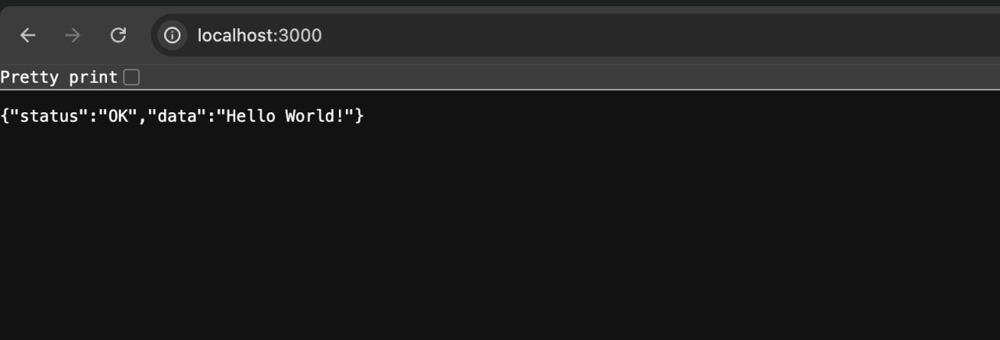

## Отчёт по лабораторной работе №1
Студенты: Хайриддинов Б.Ф.; Мухамедоа Д.А.

Группа: ПИ-430Б

Проверил: Аитбаев В.С.


### 1. Цель работы

Освоить базовые приёмы контейнеризации серверного приложения на Node.js (NestJS) и развертывания стека приложения и базы данных PostgreSQL с помощью Docker и docker-compose.

### 2. Используемые технологии и инструменты

- **Язык и фреймворк**: TypeScript, NestJS.
- **База данных**: PostgreSQL.
- **ORM**: Prisma.
- **Контейнеризация**: Docker, docker-compose.
- **Среда выполнения**: Node.js.

### 3. Архитектура проекта и Docker-стека

Проект представляет собой REST API на NestJS, который использует базу данных PostgreSQL. База данных разворачивается в контейнере Docker, приложение подключается к ней по сети.

Текущая конфигурация `docker-compose.yml`:

- сервис `postgres` на образе `postgres:latest`;
- проброс порта **5433:5432** (клиент подключается по порту 5433 на хосте);
- данные БД сохраняются в томе `postgres_data`;
- используется отдельная сеть `nestjs-course`.

Приложение NestJS по умолчанию слушает порт **3000** (`http://localhost:3000`).

### 4. Методика выполнения задания

1. **Изучить теоретическую часть** по Docker и docker-compose (понятия: образ, контейнер, том, сеть, docker-compose файл).
2. **Установить необходимое ПО**:
   - Docker Engine / Docker Desktop;
   - Node.js и npm (для запуска NestJS-приложения);
   - при необходимости WSL2 (для Windows).
3. **Клонировать репозиторий с проектом**:
   ```bash
   git clone <url-репозитория>
   cd nestjs
   ```
4. **Установить зависимости проекта**:
   ```bash
   npm install
   ```
5. **Создать файл `.env`** на основе примера (если есть) и задать переменные окружения для PostgreSQL, в том числе `POSTGRES_USER` и `POSTGRES_PASSWORD`, которые используются в `docker-compose.yml`.
6. **Поднять контейнер с PostgreSQL через docker-compose**:
   ```bash
   docker compose up -d
   ```
   После запуска контейнера БД будет доступна по адресу `localhost:5433`.
7. **Выполнить инициализацию/миграции БД (при необходимости)** с помощью Prisma:
   ```bash
   npm run db
   ```
   или соответствующей команды для применения миграций.
8. **Запустить NestJS-приложение** в режиме разработки:
   ```bash
   npm run dev
   ```
9. **Проверить работоспособность API**:
   - открыть `http://localhost:3000` или соответствующие эндпоинты;
   - убедиться, что приложение успешно подключается к PostgreSQL (по логам и/или через тестовые запросы).

### 5. Ход выполнения работы

1. Настроен файл `docker-compose.yml` для запуска PostgreSQL в отдельном контейнере с томом `postgres_data` и пробросом порта 5433.
2. Создан файл `.env` с параметрами подключения к БД (пользователь, пароль, имя БД и т.д.).
3. Установлены зависимости NestJS-приложения через `npm install`.
4. Запущен контейнер с БД командой `docker compose up -d`, проверен статус контейнера (`docker ps`).
5. Выполнена инициализация схемы базы данных при помощи Prisma.
6. Запущено приложение с помощью `npm run dev`.
7. Выполнены тестовые HTTP-запросы к API (через браузер, curl или Postman), подтверждено успешное подключение к базе данных.

При обращении к `http://localhost:3000` (или к соответствующим маршрутам API) приложение возвращает корректные ответы, использующие данные из PostgreSQL.

### 6. Инструкция по запуску проекта

1. Установить Docker и Node.js.
2. Клонировать репозиторий и перейти в каталог проекта.
3. Установить зависимости:
   ```bash
   npm install
   ```
4. Создать и заполнить `.env` (переменные для PostgreSQL и приложения).
5. Поднять базу данных:
   ```bash
   docker compose up -d
   ```
6. Применить миграции/инициализацию БД (если используется):
   ```bash
   npm run db
   ```
7. Запустить приложение NestJS:
   ```bash
   npm run dev
   ```
8. Открыть в браузере или клиенте:
   - `http://localhost:3000` – базовый адрес API.

### 7. Скриншоты

